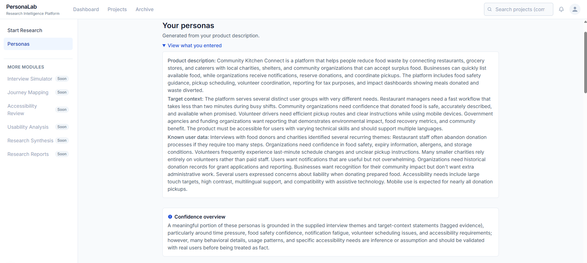
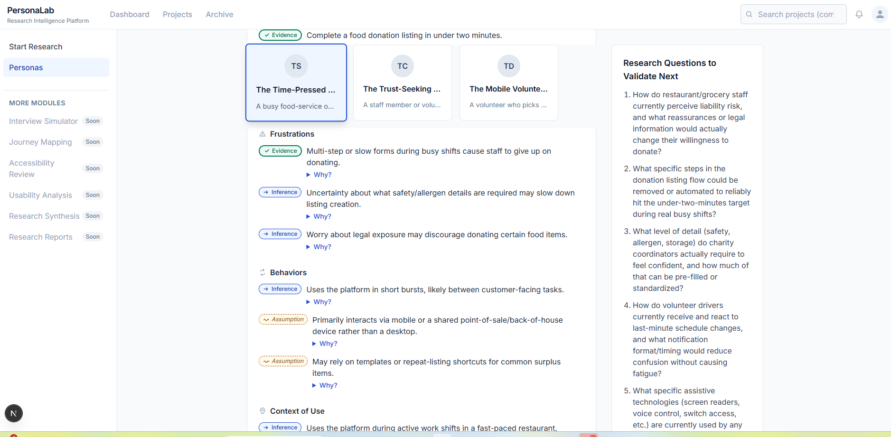
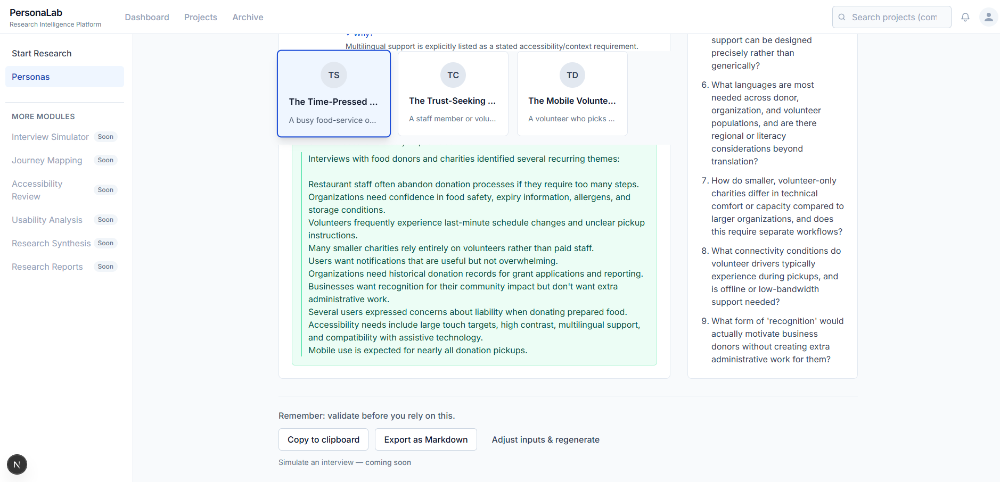
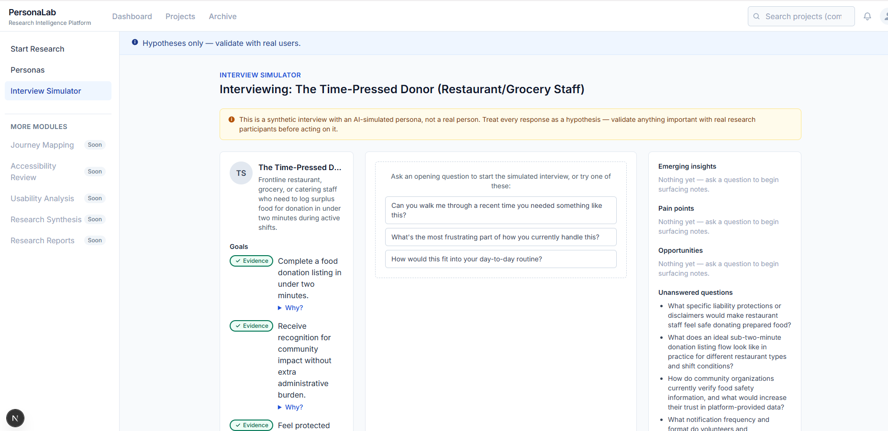
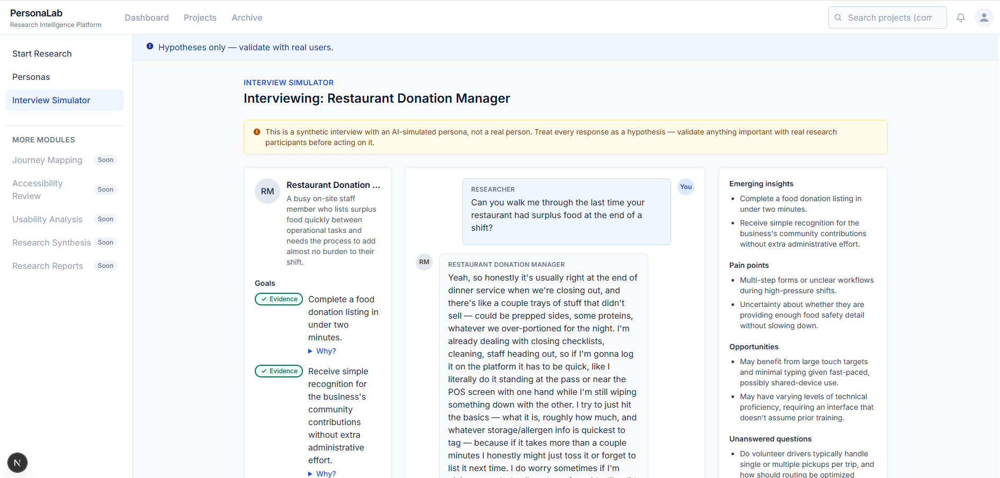

# PersonaLab

> AI-powered research intelligence platform for UX researchers, product teams, and service designers.

PersonaLab accelerates early-stage UX research by transforming product descriptions, target contexts, and existing research into evidence-based AI personas, automatically generated research questions, and AI-powered interview simulations.

Rather than replacing user research, PersonaLab helps researchers explore hypotheses, identify knowledge gaps, and prepare for interviews before engaging with real participants.

---

## Features

### 🧠 AI Persona Generation

Generate realistic research personas from:

- Product description
- Target audience
- Research notes
- Existing interview themes

Each persona includes:

- Goals
- Frustrations
- Behaviors
- Context of use
- Accessibility considerations
- Evidence confidence indicators

---

### 📊 Evidence-Based Personas

Unlike traditional AI personas, every generated statement is tagged according to confidence:

- ✅ Evidence
- 🔵 Inference
- 🟠 Assumption
- ⚪ Unknown

Researchers can immediately distinguish validated findings from AI-generated hypotheses, making it easier to prioritize future research and reduce confirmation bias.

---

### ❓ Automatically Generated Research Questions

PersonaLab analyzes the generated personas and identifies remaining knowledge gaps.

It produces research questions that help validate assumptions before design decisions are made.

Examples include:

- Questions that require user interviews
- Workflow validation
- Accessibility research
- Behavioral uncertainties
- Operational edge cases

---

### 💬 AI Interview Simulator

Conduct moderated interviews with AI-generated personas.

Each conversation is grounded in the persona's:

- Goals
- Frustrations
- Behaviors
- Context
- Accessibility needs
- Evidence confidence

The Interview Simulator allows researchers to rapidly explore user motivations before conducting real-world interviews.

Features include:

- AI-generated persona conversations
- Researcher chat interface
- Persona context panel
- Automatic insight capture
- Emerging themes
- Pain points
- Opportunities
- Outstanding research questions

---

### 🤖 Live Claude Conversations

The Interview Simulator uses Anthropic Claude to respond naturally while remaining grounded in the selected persona.

Rather than inventing random answers, Claude responds using the persona's research evidence and clearly distinguishes between:

- Evidence
- Inference
- Assumptions
- Unknowns

As interviews progress, PersonaLab automatically surfaces:

- Emerging insights
- Pain points
- Opportunities
- Research questions still requiring validation

---

## Current Modules

| Module | Status |
|---------|--------|
| Persona Generation | ✅ Complete |
| Evidence Classification | ✅ Complete |
| Research Question Generation | ✅ Complete |
| AI Interview Simulator | ✅ Complete |
| Live Claude Conversations | ✅ Complete |
| Journey Mapping | 🚧 Planned |
| Accessibility Review | 🚧 Planned |
| Usability Analysis | 🚧 Planned |
| Research Synthesis | 🚧 Planned |
| Research Reports | 🚧 Planned |

---

## Tech Stack

### Frontend

- Next.js
- React
- TypeScript
- Tailwind CSS

### AI

- Anthropic Claude API
- Structured JSON generation
- Prompt engineering
- Persona grounding
- Evidence-aware reasoning

### Testing

- Vitest

### Architecture

- Monorepo
- pnpm Workspaces
- Shared core engine
- Modular AI pipelines

---

## Design Principles

PersonaLab is designed around responsible AI for UX research.

It intentionally distinguishes between:

- Verified research
- AI inference
- Assumptions
- Unknown information

The goal is not to replace user research, but to help researchers prepare better interviews, identify blind spots earlier, and accelerate research planning.

Every screen reminds researchers that AI outputs are hypotheses requiring validation with real users.

---

## Roadmap

Upcoming modules include:

- Journey Mapping
- Accessibility Review
- Usability Analysis
- Research Synthesis
- Executive Research Reports
- Research Project Management
- Multi-persona interview comparison
- Conversation export
- PDF research reporting

---

## Disclaimer

PersonaLab generates synthetic personas and simulated interviews.

These outputs are intended to support UX research planning and exploration only.

They should never replace research conducted with real users.

All generated insights should be validated through appropriate qualitative and quantitative research methods.

---

## Author

Designed and built by **Diane King**

Senior UX / Product Designer • AI Product Design • Conversational AI • Human-Centered Design

GitHub: https://github.com/DKTODesigns
